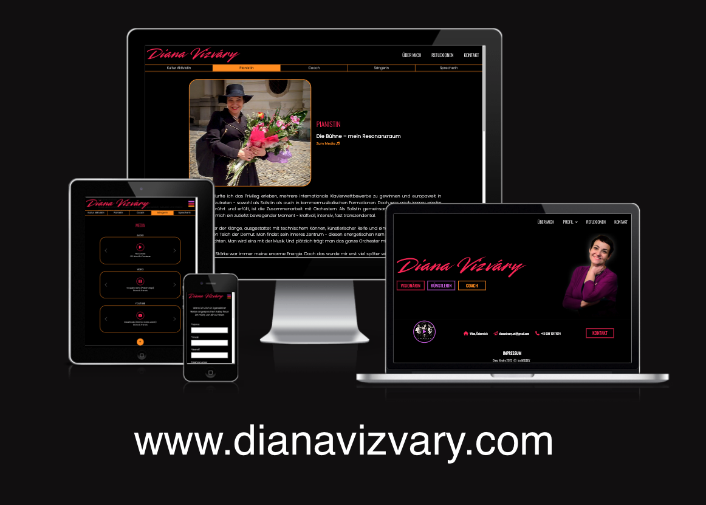

# Diana Vizváry – Official Website

Welcome to the source code of the official website for [Diana Vizváry](https://dianavizvary.com/) — pianist, music coach, singer, speaker, and cultural activist.

This responsive Angular website showcases Diana's artistic journey, media content, and creative projects through a clean layout with a strong focus on design, accessibility, and performance.

🔗 [livesite](https://dianavizvary.com)

## Features

The website features:

- A **modern portfolio** and profile-based navigation
- Each profile has a media section with: **Audios, videos and youtube links carousels**
- Responsive mobile first design
- Smooth scroll and scroll-reset behavior for UX consistency

## Technologies Used

- **Angular 19.2.6.**
- **TypeScript**
- **SCSS / CSS**
- **Bootstrap 5** (Accordion, Carousel, Responsive Grid System)
- **FontAwesome** (Icons)
- **HTML5 + Responsive Design** (Mobile, Tablet, Desktop)
- **CSS Variables** for theme consistency

### Media & Credits

All content, media, and visuals are the artistic work of Diana Vizváry.
Design and user flow were tailored to reflect her interdisciplinary identity across:

    - Arts activism and cultural engagement
    - Classical piano performance 
    - Music coaching
    - Singing and speaking

## License

This repository is for educational and portfolio presentation purposes.
All content (images, texts, videos) is protected and may not be used commercially without permission.
